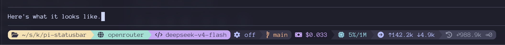
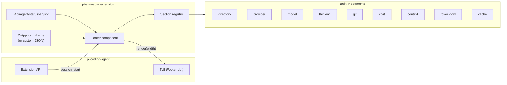

# pi-statusbar

A configurable statusbar footer for the pi-coding-agent TUI. It shows
context about your current session: the working directory, model and
provider, thinking level, git status, token usage, context window,
cache reads and writes, and running cost.

It's powered by powerline-style segments with a Catppuccin Mocha theme.
You can reorder, remove, or add sections, change the divider between
them, or swap the whole colour theme.

## How it looks

The statusbar sits at the bottom of the pi TUI. Each section is a
coloured segment separated by powerline chevrons (or rounded caps
between certain sections). Sections appear from left to right in the
order you've configured.



## How it works



On `session_start`, pi-statusbar registers a footer component with the
pi TUI. Each render pass walks the configured section list, calls each
section's render function with lazy accessors (no wasted computation
for sections that never read the data), wraps the text in ANSI styling
from the theme, and joins everything with powerline divider characters.

The git section runs a background poller — it checks `git status` every
few seconds and caches the result so the render path doesn't block on a
subprocess.

## Install

pi-statusbar isn't on npm. Install from the git repository using
`pi install`:

```bash
pi install git@github.com:kreeger/pi-statusbar.git
```

Pass the repository URL directly as a single argument.

If you've cloned the repository locally, you can also install from
the local path:

```bash
pi install /path/to/pi-statusbar
```

After installation, restart your pi session. The statusbar appears
automatically — there's no activation step needed.

### Verify it is installed

```bash
ls ~/.pi/agent/extensions/pi-statusbar/
```

You should see TypeScript source files. The pi agent loads extensions
from this directory at startup.

## Configuration

### Section order

Create `~/.pi/agent/statusbar.json`. The default configuration (used
when this file doesn't exist) is:

```json
{
  "divider": " | ",
  "sections": [
    "directory", "provider", "model", "thinking",
    "git", "cost", "context", "token-flow", "cache"
  ]
}
```

The `divider` field is the text inserted between sections when
powerline glyphs aren't available (not typically visible in the TUI).
The `sections` array lists the built-in segment IDs in display order.
Remove any you don't want, or reorder them.

### Custom themes

Add a `themePath` field pointing to a JSON file with ANSI escape
sequences for foreground and background colours:

```json
{
  "sections": ["directory", "git", "cost"],
  "themePath": "/home/you/.pi/themes/my-theme.json"
}
```

The theme file merges over the built-in Catppuccin theme. Each section
can override foreground (`fg`) and background (`bg`) as raw SGR escape
sequences. A `defaultSection` catches any section without its own
entry. Here's an example theme file:

```json
{
  "defaultSection": {
    "fg": "\u001b[38;2;147;153;178m",
    "bg": ""
  },
  "sections": {
    "directory": {
      "fg": "\u001b[38;2;55;55;75m",
      "bg": "\u001b[48;2;249;226;175m"
    },
    "git": {
      "fg": "\u001b[38;2;250;179;135m",
      "bg": "\u001b[48;2;55;55;75m"
    }
  }
}
```

Only the keys you provide are replaced. Sections not mentioned keep
their Catppuccin defaults.

## Built-in segments

| ID | Shows |
|---|---|
| `directory` | Current working directory, abbreviated (e.g. `~/src/my-project` becomes `~/s/my-project`) |
| `provider` | Model provider name (e.g. `anthropic`, `openai`) |
| `model` | Model identifier, provider prefix stripped (e.g. `claude-sonnet-4-20250514`) |
| `thinking` | Current thinking level setting |
| `git` | Git branch, ahead/behind counts, and file change counts (`+` added, `~` modified, `-` deleted, `?` untracked) |
| `cost` | Running session cost |
| `context` | Context window usage percentage and total window size |
| `token-flow` | Input and output token counts for the session |
| `cache` | Cache reads and writes (prompt caching) |

## Writing custom segments

External extensions can register custom sections with pi-statusbar's
SectionRegistry. The registry is available on the global scope at
`__piStatusbarRegistry`. Call `register()` with an object that has an
`id` and a `render(ctx)` function.

Here's a complete extension that adds a section showing the current
time:

```typescript
import type { ExtensionAPI } from "@earendil-works/pi-coding-agent";
import type { SectionAccessors } from "./types.js";

export default function (pi: ExtensionAPI) {
  pi.on("session_start", (_event, ctx) => {
    if (!ctx.hasUI) return;

    const registry = (globalThis as any).__piStatusbarRegistry;
    if (!registry) return;  // pi-statusbar not installed

    registry.register({
      id: "clock",
      render(ctx: SectionAccessors) {
        return new Date().toLocaleTimeString([], {
          hour: "2-digit",
          minute: "2-digit",
        });
      },
    });
  });
}
```

After installing this extension, add `"clock"` to the sections array in
`statusbar.json`:

```json
{
  "sections": ["directory", "clock", "git", "cost"]
}
```

### How custom segment registration works

1. pi-statusbar creates a `SectionRegistry` on session start and
   exposes it as `globalThis.__piStatusbarRegistry`.
2. External extensions access the registry in their own
   `session_start` handler (which runs after pi-statusbar's).
3. `register()` accepts any object matching the `StatusbarSection`
   interface: `{ id: string; render(ctx: SectionAccessors): string |
   undefined }`.
4. If your `id` matches a built-in section, yours replaces it.
5. Unknown IDs in `statusbar.json` are silently skipped, so you must
   list your custom ID in the sections array for it to appear.

### Section accessors

The `render` function receives a `SectionAccessors` object. Each
getter is lazy — it only computes when called, and caches the result
for the current render pass. If your section doesn't call a getter,
that data is never collected.

```typescript
interface SectionAccessors {
  getCwd(): string;
  getModel(): StatusbarModel | undefined;
  getThinkingLevel(): string;
  getUsage(): StatusbarUsage;
  getContextUsage(): StatusbarContextUsage | undefined;
  getGit(): GitStatusSnapshot;
}
```

### Type definitions

The pi-statusbar source includes full TypeScript types in `types.ts`.
You can reference them from your extension by importing from the
extension directory, or copy the types you need.

## Development

### Setup

Clone the repository and install dependencies:

```bash
git clone git@github.com:kreeger/pi-statusbar.git
cd pi-statusbar
npm install
```

### Running tests

```bash
npm test
```

Tests live alongside source files (`.test.ts`). They run with Vitest.
There are tests for the section registry, config parsing, theme
loading, the ANSI styler, the git state poller, the format utilities,
and the extension lifecycle.

### Deploying your changes

The `deploy` script copies the source files (minus test files) to
`~/.pi/agent/extensions/pi-statusbar/`. Use it to push local changes
into pi without publishing to npm:

```bash
npm run deploy
```

Restart your pi session to pick up changes.

### Architecture notes

- `index.ts` — Extension entry point. Hooks into session lifecycle,
  wires up config, theme, registry, and git polling.
- `config.ts` — Reads `statusbar.json` from disk. Falls back to
  defaults when the file is missing or invalid.
- `registry.ts` — Holds the mapping of section IDs to render
  functions. External extensions push into this.
- `footer.ts` — Creates the TUI Component. Each render pass collects
  data lazily then delegates to the styler.
- `styler.ts` — Interface for all ANSI rendering. Keeps layout code
  free of escape codes.
- `themes/` — Theme loading and the built-in Catppuccin theme.
- `sections/` — Built-in section implementations.
- `git/` — Asynchronous git status polling.
- `format.ts` — Shared number/string formatting utilities.

## License

MIT